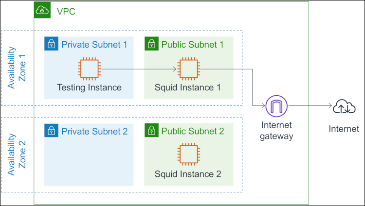
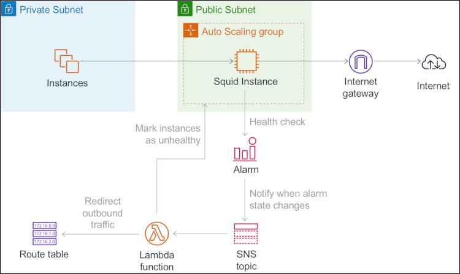

# AWS CDK Python project to deploy DNS filtering with Squid

This [AWS CDK](https://aws.amazon.com/cdk/) project deploys [Squid](http://www.squid-cache.org/) proxy instances to implement a “transparent proxy” that can restrict both HTTP and HTTPS outbound traffic to a given set of Internet domains, while being fully transparent for instances in the private subnet. 

>This project builds the soultion as described in the AWS Security blog: [How to add DNS filtering to your NAT instance with Squid](https://aws.amazon.com/blogs/security/how-to-add-dns-filtering-to-your-nat-instance-with-squid/).

#### Architecture
In summary, the CDK project deploys a VPC with 2 public and 2 private subnets across 2 availability zones. Squid proxy instances in the public subnets intercept HTTP/S traffic and then initiate a connection with the destination through the Internet gateway. A test EC2 instance is provisioned in one private subnet



#### Addressing availability
The following diagram describes the solution used to address availability in case a Squid instance fails and traffic must be routed via the other available instance.




A CloudWatch Alarm is used to monitor the status of the squid instance. A change in the alarm status from `OK` to `ALARM` triggers a Lambda function that marks the instance as unhealthy and updates the route table attached to the private subnets in the affected AZ to redirect outbound traffic to a healthy Squid instance in the other AZ.

 The Auto Scaling group replaces the unhealthy instance with a healthy Squid instance. Once the alarm status changes from `ALARM` back to `OK`, the Lambda function is triggered to update the route table to this instance. 

#### CDK Recap

A quick recap: The  AWS CDK allows developers use the CDK framework in one of the supported programming languages to define reusable cloud components called [constructs](https://docs.aws.amazon.com/cdk/latest/guide/constructs.html), which are composed together into [stacks](https://docs.aws.amazon.com/cdk/latest/guide/stacks.html), forming a ["CDK app"](https://docs.aws.amazon.com/cdk/latest/guide/apps.html).

This CDK app includes 3 stacks:
 * **VPC stack**:             A VPC across 2 AZs with 1 public and 1 private subnet in each AZ
 * **Squid stack**:           Squid instances in Auto Scaling Groups with required components to achieve high availablity. 
 * **Test instance stack**:   A test instance that can be accessed using AWS Systems Manager Session Manager

##### **Context**
[AWS CDK Context values](https://docs.aws.amazon.com/cdk/latest/guide/context.html) are key-value pairs that can be associated with a stack or construct. In this project they are used for some basic information required to deploy the solution. 

The `context` key in the `cdk.json` file is one of the ways that context values can be made available to the CDK app. 

Here, it is used to get some basic information required to deploy the resources in your AWS Account. This allows you the possibility to extend this to add multiple accounts, regions, separate VPC CIDRs and use a different runtime context to deploy resources.

```
"region": "ap-southeast-1",
"account": "xxxxxxxxxxxx",
"vpc_cidr": "10.0.0.0/16"
```

#### **CDK Squid app**

The “main” for the CDK app is the `app.py`. We get the context values defined in the `cdk.json` file
```
# Get context variable values 
account = app.node.try_get_context('account')
region = app.node.try_get_context('region')
vpc_cidr = app.node.try_get_context('vpc_cidr')
```
Prepare the ["environment"](https://docs.aws.amazon.com/cdk/latest/guide/environments.html). An environment is the target AWS account and AWS Region into which the stack is intended to be deployed.

```
env = core.Environment(account=account, region=region)
```

We pass these to the VPC stack. 

 ```
VPCStack(app, "vpc", env=env, vpc_cidr=vpc_cidr)
```
To create the Squid and Test Instance stacks, the VPC is required. We pass the VPC construct created as part of the VPC stack to these 2 stacks. This will allow us to use this VPC within these stacks. 

```
SquidStack(app, "squid", env=env, vpc=vpc_stack.vpc)

TestInstanceStack(app, "test-instance", env=env, vpc=vpc_stack.vpc)
 ```
The AWS CDK creates an implicit dependency between the VPC stack and these stacks.

Let's dive a little deeper into the stacks

### **VPC stack**
The [VPC stack](./squid_app/vpc_stack.py) creates a VPC across 2 AZs, with 2 public and 2 isolated subnets using a high level CDK Construct. We use the `vpc_cidr` context value to define the VPC CIDR.

```
ec2.Vpc(self, "vpc",
   max_azs=2,
   cidr=vpc_cidr,
   subnet_configuration=[ec2.SubnetConfiguration(
      subnet_type=ec2.SubnetType.PUBLIC,
      name="Public",
      cidr_mask=24
      ), 
      ec2.SubnetConfiguration(
      subnet_type=ec2.SubnetType.ISOLATED,
      name="Isolated",
      cidr_mask=24
      )
   ]
)
```
Note that we use `ISOLATED` as do not want NAT Gateways to be provisoned as part of the VPC. The Squid instances will be used as NAT instances.

### **Squid stack**
The [Squid stack](./squid_app/squid_stack.py) consists of 3 Constructs:

1. **SquidAsgConstruct** ([`squid_asg_construct.py`](./squid_app/squid_asg_construct.py)): This construct creates the core Squid application. It creates 2 Auto Scaling Groups (ASGs), one in each public subnet, that consist of one Squid instance each, an IAM role to attach to the instances and a S3 bucket to hold Squid configuration files.  

First we create the IAM role using a combination of managed policies and a custom policy
```
 # create an IAM role to attach to the Squid instances
squid_iam_role = iam.Role(self,"squid-role", 
   assumed_by=iam.ServicePrincipal("ec2.amazonaws.com"),
   managed_policies=[iam.ManagedPolicy.from_aws_managed_policy_name("CloudWatchAgentServerPolicy"),
   iam.ManagedPolicy.from_aws_managed_policy_name("service-role/AmazonEC2RoleforSSM")]
)

# Add policy to allow EC2 update instance attributes
squid_iam_role.add_to_policy(statement= iam.PolicyStatement(effect=iam.Effect.ALLOW,
   actions=['ec2:ModifyInstanceAttribute',],
   resources=['*']
   )
)
```

Then, we create the S3 bucket

```
squid_config_bucket = s3.Bucket(self,"squid-config",
                        encryption = s3.BucketEncryption.KMS_MANAGED)
```

Upload the Squid config files to this bucket. The config files are located in the `./squid_app/squid_config_files/config_files_s3/`

`allowed_domains.txt` contains the allowed domains on the Squid proxy
`squid.conf` is the configuration file used to configure Squid 

```
s3_deployment.BucketDeployment(self,"config",
   destination_bucket=squid_config_bucket,
   sources=[s3_deployment.Source.asset(path='./squid_app/squid_config_files/config_files_s3')]
)
```
The instance role requires access to this S3 bucket.
```
squid_config_bucket.grant_read_write(identity=squid_iam_role)
```

Define the AMI to be used for the Squid instances. In this case we are using Amazon Linux 2.

```
amazon_linux_2_ami = ec2.MachineImage.latest_amazon_linux(
   generation=ec2.AmazonLinuxGeneration.AMAZON_LINUX_2,
   edition=ec2.AmazonLinuxEdition.STANDARD,
   virtualization=ec2.AmazonLinuxVirt.HVM,
   storage=ec2.AmazonLinuxStorage.GENERAL_PURPOSE
)
```

As a Squid instance is required in each AZ, we loop through the availability zones for this VPC and create an ASG with min, max and desired capacity as 1 in each AZ in a public subnet. For this example, we are using a `t3.nano` instance.

Note the usage of resource signal that lets CloudFormation know if the resource was created successfully (or failed).

```
for count, az in enumerate(vpc.availability_zones, start=1):
   asg = autoscaling.AutoScalingGroup(self,f"asg-{count}",vpc=vpc,
      instance_type=ec2.InstanceType("t3.nano"),
      desired_capacity=1,
      max_capacity=1,
      min_capacity=1,
      machine_image=amazon_linux_2_ami,
      role=squid_iam_role,
      vpc_subnets=ec2.SubnetSelection(
         availability_zones=[az],
         one_per_az=True,
         subnet_type=ec2.SubnetType.PUBLIC
         ),
      health_check=autoscaling.HealthCheck.ec2(grace=core.Duration.minutes(5)),
      resource_signal_count=1,
      resource_signal_timeout=core.Duration.minutes(10)
   )
```

The user data bash script is located `./squid_app/squid_config_files/user_data/squid_user_data.sh`. It  disables source/destination check on the instance to allow for the instance to be used as a NAT instance, installs and configures Squid and installs and configures the CloudWatch Agent. The agent collects CPU usage metrics for the Squid process every 10 seconds and collect and store Squid access and cache logs in CloudWatch Logs.  

A dictionary is used to create a mapping of the values requried in the user data of the Launch Configuration of the ASG.

```
user_data_mappings = {"__S3BUCKET__": squid_config_bucket.bucket_name,
   "__ASG__": asg_logical_id,
   "__CW_ASG__": "${aws:AutoScalingGroupName}"
   }
```

We can use core.Fn.sub() (equivalent of [CloudFormation Fn::Sub](https://docs.aws.amazon.com/AWSCloudFormation/latest/UserGuide/intrinsic-function-reference-sub.html)) to substitute with values that are avaialable at runtime and use this as the user data for the instances launched in this Launch Configuration.

```
# Replace parameters with values in the user data
with open("./squid_app/squid_config_files/user_data/squid_user_data.sh", 'r') as user_data_h:
   # Use a substitution
   user_data_sub = core.Fn.sub(user_data_h.read(), user_data_mappings)

# Add User data to Launch Config of the autoscaling group
asg.add_user_data(user_data_sub)
```

Security group attached to the instances allow communication on ports 80 & 443 from VPC CIDR

```
asg.connections.allow_from(other=ec2.Peer.ipv4(vpc.vpc_cidr_block),
   port_range=ec2.Port(
      protocol=ec2.Protocol.TCP,
      string_representation="HTTP from VPC",
      from_port=80,
      to_port=80
   )
)

asg.connections.allow_from(other=ec2.Peer.ipv4(vpc.vpc_cidr_block),
   port_range=ec2.Port(
      protocol=ec2.Protocol.TCP,
      string_representation="HTTPS from VPC",
      from_port=443,
      to_port=443
   )
)
```

A [Lifecycle Hook](https://docs.aws.amazon.com/autoscaling/ec2/userguide/lifecycle-hooks.html) is used to allow for the completion of the Squid configuration before the instance is marked healthy.

```
autoscaling.LifecycleHook(self,f"asg-hook-{count}",
   auto_scaling_group=asg,
   lifecycle_transition=autoscaling.LifecycleTransition.INSTANCE_LAUNCHING,
   notification_target=hooktargets.TopicHook(sns.Topic(self,f"squid-asg-{count}-lifecycle-hook-topic", 
      display_name=f"Squid ASG {count} Lifecycle Hook topic")
   ),
   default_result=autoscaling.DefaultResult.ABANDON,
   heartbeat_timeout=core.Duration.minutes(5)
)
```
We use a route table tag on the ASG to identify the private route table attached to the private subnet in an AZ. 

```
# Loop through all non public subnets in AZ to identify route table and create a tag value string
for subnet in non_public_subnets_in_az:
   if route_table_ids:
      route_table_ids=f"{route_table_ids},{subnet.route_table.route_table_id}"
   else:
      route_table_ids=subnet.route_table.route_table_id

# Tag the ASG with route table ids
core.Tag.add(asg,
      key='RouteTableIds',
      value=route_table_ids,
      apply_to_launched_instances=False
)
```

2. **SquidMonitoringConstruct** ([`squid_monitoring_construct.py`](./squid_app/squid_monitoring_construct.py)): This construct creates the Squid health check Alarms for the ASGs and a SNS topic where notifcations are published when alarm state changes.

Create the SNS topic

```
self.squid_alarm_topic = sns.Topic(self,"squid-asg-alarm-topic", display_name='Squid ASG Alarm topic')
```

For each Squid ASG, create a metric to monitor the Squid process using the CloudWatch Agent. More info on the [`procstat`](https://docs.aws.amazon.com/AmazonCloudWatch/latest/monitoring/CloudWatch-Agent-procstat-process-metrics.html) plugin

```
squid_metric = cloudwatch.Metric(metric_name="procstat_cpu_usage",
   namespace='CWAgent',
   dimensions=dict(AutoScalingGroupName=asg.auto_scaling_group_name,
      pidfile="/var/run/squid.pid",
      process_name="squid")
)
```
For each Squid ASG, create a CloudWatch Alarm based on the metric above. The alarm checks every 10 seconds if the metric goes breaches the threshold or if data points are missing 

```
squid_alarm = cloudwatch.Alarm(self,f"squid-alarm-{count}",
   alarm_description=f"Heart beat for Squid instance {count}",
   alarm_name=f"squid-alarm_{asg.auto_scaling_group_name}",
   comparison_operator=cloudwatch.ComparisonOperator.LESS_THAN_THRESHOLD,
   metric=squid_metric,
   period=core.Duration.seconds(10),
   evaluation_periods=1,
   threshold=0.0,
   statistic='Average',
   treat_missing_data=cloudwatch.TreatMissingData.BREACHING
)
```

CloudWatch Alarm actions are configured to send notifications on state changes to the SNS topic.

```
squid_alarm.add_alarm_action(cw_actions.SnsAction(self.squid_alarm_topic))
squid_alarm.add_ok_action(cw_actions.SnsAction(self.squid_alarm_topic))
```

3. **SquidLambdaConstruct** ([`squid_lambda_construct.py`](./squid_app/squid_lambda_construct.py)): This construct creates the Lambda function that is triggered when the alarm state changes and the IAM role assumed by Lambda to execute this function.

Similar to the IAM role created for the instances in the ASGs, we create an IAM role required for Lambda.

```
# Create IAM role for Lambda
lambda_iam_role = iam.Role(self,"lambda-role", 
   assumed_by=iam.ServicePrincipal("lambda.amazonaws.com"),
   managed_policies=[iam.ManagedPolicy.from_aws_managed_policy_name("service-role/AWSLambdaBasicExecutionRole")]
)

# Add policies to allow Lambda that allow it to update route tables of the VPC to point to a healthy Squid instance ENI
lambda_iam_role.add_to_policy(statement= iam.PolicyStatement(effect=iam.Effect.ALLOW,
   actions=['ec2:ModifyInstanceAttribute',
         'autoscaling:Describe*',
         'autoscaling:CompleteLifecycleAction',
         'autoscaling:SetInstanceHealth',
         'cloudwatch:Describe*',
         'ec2:CreateRoute',
         'ec2:CreateTags',
         'ec2:ReplaceRoute',
         'ec2:Describe*',
         ],
   resources=['*']
   )
)
```

Then, we create the Lambda function. The ARN of the SNS Topic created in the Monitoring construct is used as an environment variable for the Lambda function.

```
squid_alarm_lambda = _lambda.Function(self, "alarm-function",
   runtime=_lambda.Runtime.PYTHON_3_8,
   handler="lambda-handler.handler",
   code=_lambda.Code.asset("./squid_app/squid_config_files/lambda"),
   role=lambda_iam_role,
   environment={"TOPIC_ARN":squid_alarm_topic.topic_arn},
   timeout=core.Duration.seconds(60)
)
```

The Lambda function code is located: `./squid_app/squid_config_files/lambda/lambda-handler.py`. It parses the SNS event to identify the ASG that published the message and if the Alarm state is `ALARM` or `OK`. 

If the state is `ALARM`, the function will mark the instance as unhealthy and update the route table of the privat subnets of the affected AZ to redirect the traffic to a healthy Squid instance. 

If the state is `OK`, the function will complete the Auto Scaling Lifycle Hook action as complete which marks the instance as healthy and then update the route table of the privat subnets to route the traffic via the Squid instance in the same AZ. 

Permissions have to be provided for the SNS Topic to invoke the Lmabda function.

```
squid_alarm_lambda.add_permission("squid-lambda-permission",
   principal=iam.ServicePrincipal("sns.amazonaws.com"),
   action='lambda:InvokeFunction',
   source_arn=squid_alarm_topic.topic_arn
)
```

Also, Lambda must be subscribed to the SNS Topic.

```
squid_alarm_topic.add_subscription(sns_subscriptions.LambdaSubscription(squid_alarm_lambda))
```

### **Test Instance stack**
The [Test Instance](./squid_app/test_instance_stack.py) stack creates a single EC2 instance in the Isolated subnet and an IAM role attached to the instance.

The IAM role has a single AWS Managed policy attached to it that allows access to this instance from AWS Systems Manager Session Manager

```
instance_role = iam.Role(self, "test-instance-SSM-role", 
   assumed_by=iam.ServicePrincipal("ec2.amazonaws.com")
)

instance_role.add_managed_policy(iam.ManagedPolicy.from_aws_managed_policy_name("service-role/AmazonEC2RoleforSSM"))
```

The test instance also uses Amazon Linux 2. It is placed in the isolated subnet with all outboud access allowed.

```
ec2.Instance(self, "test-instance",
   instance_type=ec2.InstanceType("t3.nano"),
   machine_image=amazon_linux_2_ami,
   vpc=vpc,
   vpc_subnets=ec2.SubnetSelection(
         subnet_type=ec2.SubnetType.ISOLATED
   ),
   role=instance_role,
   allow_all_outbound=True
)
```

## Deploying the solution 

Pre-requisites:

-	An AWS account
-	[AWS CLI, authenticated and configured](https://docs.aws.amazon.com/cli/latest/userguide/cli-configure-files.html)
-	[Python 3.6+](https://www.python.org/downloads/)
-	[AWS CDK](https://docs.aws.amazon.com/cdk/latest/guide/getting_started.html)
-	[Git](http://git-scm.com/downloads)


### 1: Clone the Git repository
```
git clone https://github.com/aws-samples/aws-cdk-transparent-squid-proxy 
```

### 2: Prepare context variables

[AWS CDK Context values](https://docs.aws.amazon.com/cdk/latest/guide/context.html) are key-value pairs that can be associated with a stack or construct. In this project they are used for some basic information required to deploy the solution. 

The `context` key in the `cdk.json` file is one of the ways that context values can be made available to the CDK app. 

Navigate to the cloned directory
```
$ cd aws-cdk-transparent-squid-proxy
```
Open the `cdk.json` file in a text editor and update the following values required by the CDK app:

 * **`account`**:    The AWS account number to deploy the stacks
 * **`region`**:     The AWS region to deploy the stacks
 * **`vpc_cidr`**:   The CIDR range to use for the VPC

Note that the `cdk.json` also states which Python command to use. Depending on your setup this may either be `python3` or `python`. Please update this if necessary for the `app` key in the `cdk.json` file.

`"app": "python app.py"`  **Or**  `"app": "python3 app.py"`

>For all following steps `python` will be used. Replace if necessary

### 3. Create and activate the virtual environment

```
$ python -m venv .env
$ source .env/bin/activate
```

### 4. Install dependencies

```
$ pip install -r requirements.txt
```

### 5. Synthesize the templates
When CDK apps are executed, they produce (or “synthesize") an AWS CloudFormation template for each stack defined in the application. 

```
$ cdk synth
```
After this command executes successfully you can view the CloudFormation templates in the `cdk.out` folder

### 6. Bootstrap the environment
The first time you deploy an AWS CDK app into an environment (account/region), you’ll need to install a “bootstrap stack”. This stack includes resources that are needed for the CDK toolkit’s operation. For example, the stack includes an S3 bucket that is used to store templates and assets during the deployment proces

```
$ cdk bootstrap
```

### 7. Deploy the solution
Deply all stacks to your AWS account & region

When prompted, approve the request to allow CloudFormation to create IAM roles and security groups (Answer *y* to the question: *Do you wish to deploy these changes?*). 

If you want to override the approval prompts, add the **`--require-approval never`** option

```
$ cdk deploy "*"
```
This will begin the process of deploying the 3 stacks. The `*` means that all stacks in the CDK app will be deployed
  

## Testing the solution

1. On the [AWS Systems Manager console](https://console.aws.amazon.com/systems-manager/): Choose **Session Manager**
2. Select the *test instance* and choose **Start Session**
3. After the connection is made, you can test the solution with the following commands. Only the last 2 requests should return a valid response, because Squid allows traffic to `*.amazonaws.com` only.
   1. `curl http://www.amazon.com`
   2. `curl https://www.amazon.com`
   3. `curl http://calculator.s3.amazonaws.com/index.html`
   4. `curl https://calculator.s3.amazonaws.com/index.html`

To test with other other domains, you can update the `allowed_domains.txt` file in S3 with allowed domains and wait for the configuration to get updated (~1-2 mins) 

## Cleaning up
A CDK application can be destroyed by using the following command: 
```
$ cdk destroy "*"`
```
When asked to confirm the deletion of the 3 stacks, select “`y`”.

## Resources
[AWS CLoud Development Kit (CDK) Developer Guide](https://docs.aws.amazon.com/cdk/latest/guide/home.html)  
[AWS CDK API Reference](https://docs.aws.amazon.com/cdk/api/latest/docs/aws-construct-library.html)  
[AWS CDK Workshop](https://cdkworkshop.com/)  
[AWS CDK Examples](https://github.com/aws-samples/aws-cdk-examples)

## License
This library is licensed under the MIT-0 License. See the [LICENSE](LICENSE) file.